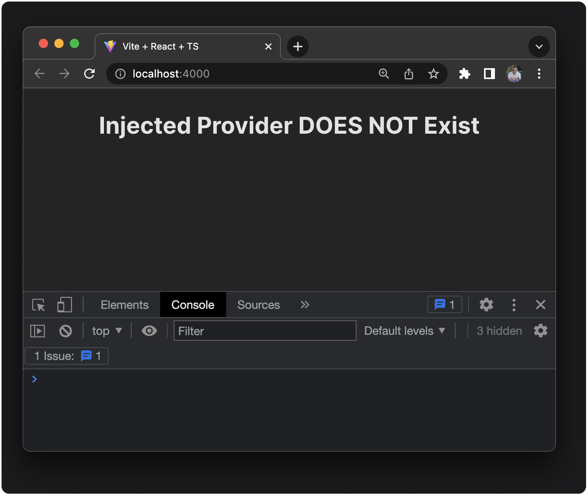
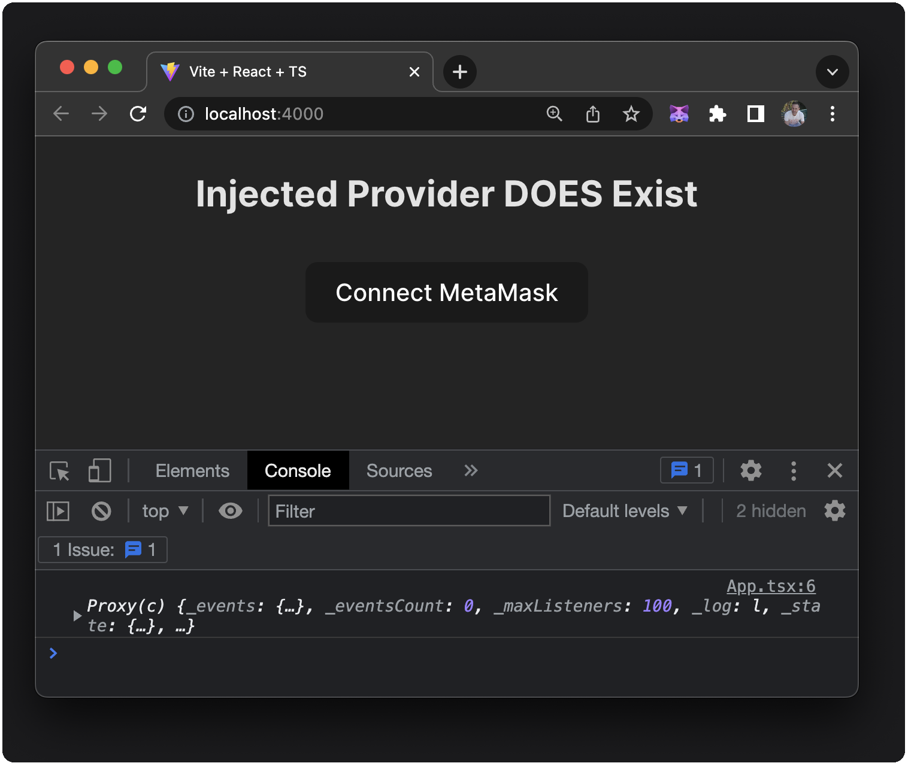
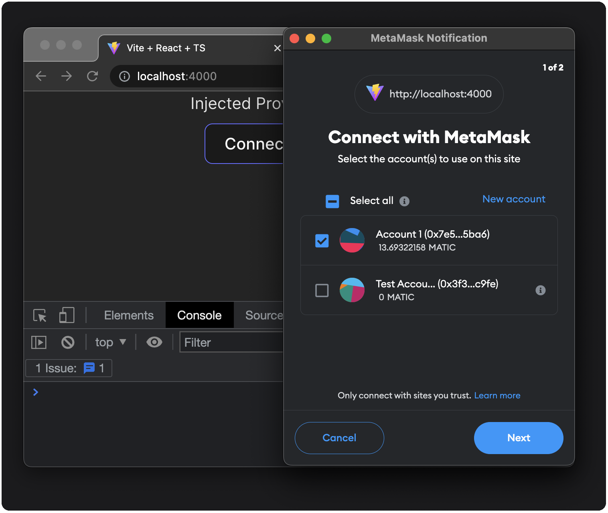
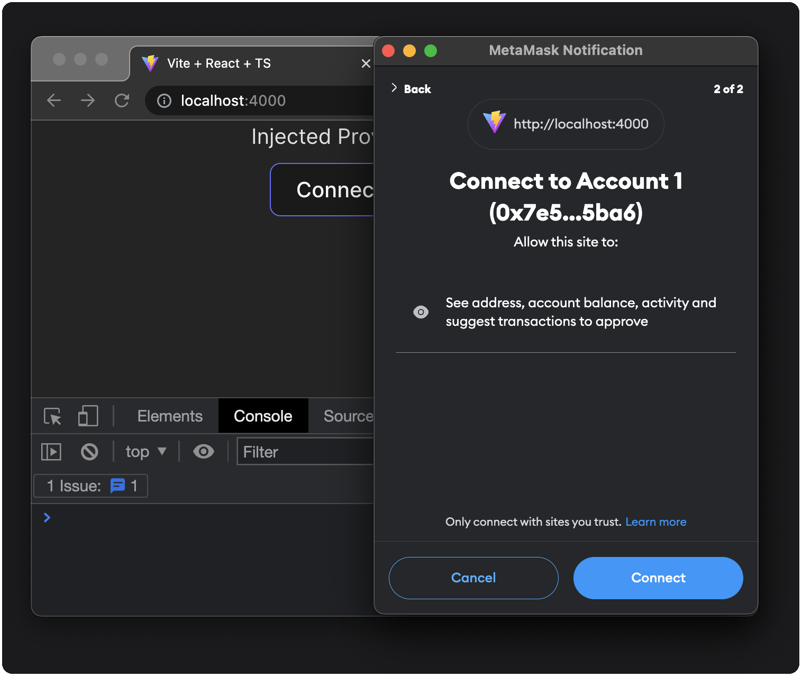
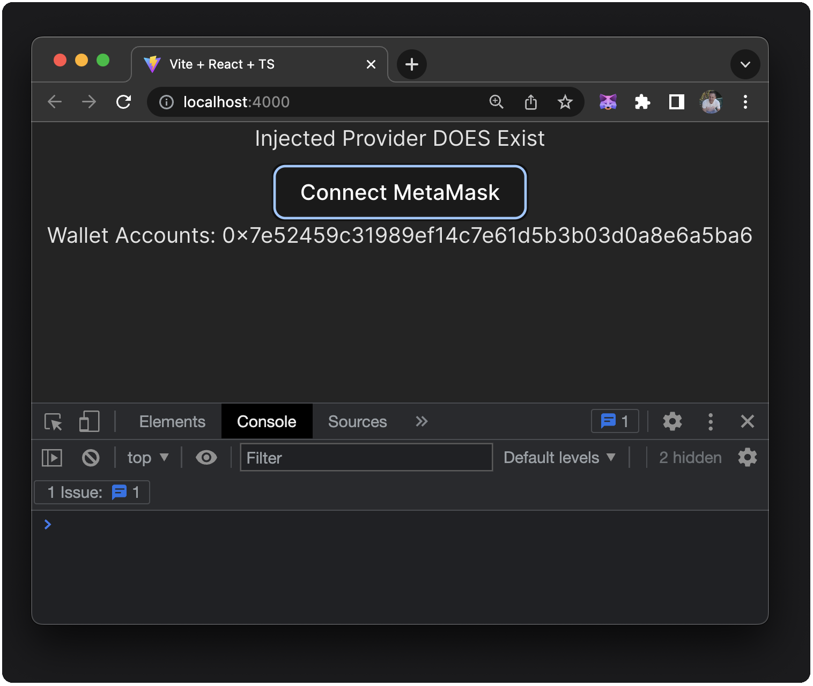
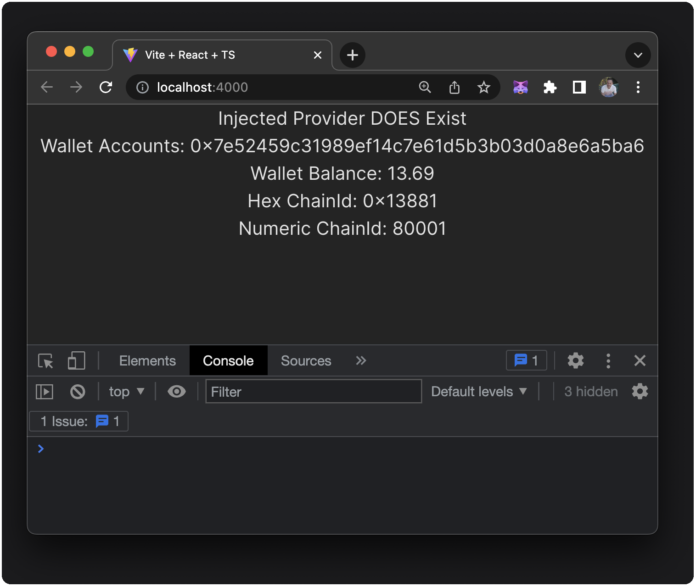
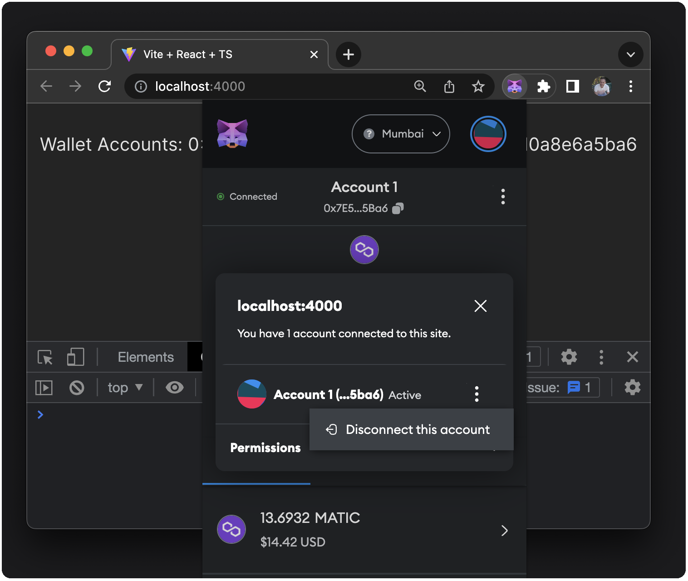
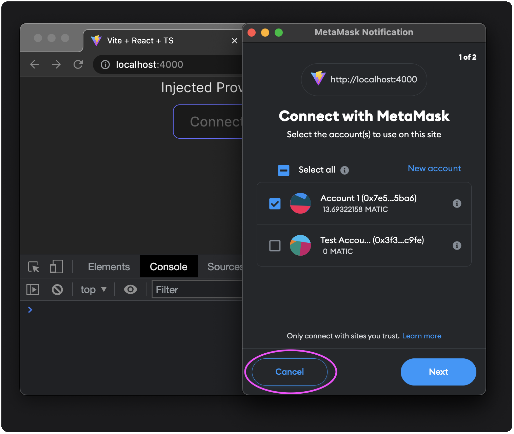
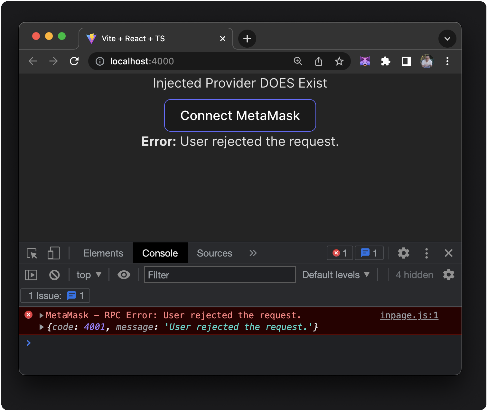

## Table of Contents

- [Pre Requisites](#pre-requisites)
- [Why Vite and React](#why-vite-and-react)
- [Scaffold a Vite React Project](#scaffold-vite)
- [Detecting MetaMask](#detecting-metamask)
- [Connecting to MetaMask](#connecting-to-metamask)
- [Manage More MetaMask State Locally](#manage-more-metamask-state-locally)
  - [Watch User Balance and Chain](#watch-user-balance-and-chain)
  - [Basic Error Handling](#basic-error-handling)
- [Single Component Conclusion](#single-component-conclusion)

## Pre Requisites

Ensure you have the following before starting this tutorial.

- Node Version 18+
- NPM Version 9+
- Code Editor
- [MetaMask Extension](https://metamask.io/download)
- Basic Knowledge of JavaScript and React

## Why Vite and React

[Vite.js](https://v3.vitejs.dev/guide) is a build tool for modern web projects. You can create VanillaJS, Vue, React, Preact, Lit, and Svelte projects using JavaScript or TypeScript.

This tutorial uses Vite + React (with TypeScript). We will step up our use of TypeScript only as we need to.

We will build up our knowledge of working with MetaMask incrementally; this may mean we don't go with the best solution right out of the gate, but the idea is to experiment with the MetaMask API and continually work towards better solutions.

Using React makes working with state management and building with components that need updating easy and allows us to rapidly develop an application using a library and concepts familiar to most web developers.

## Scaffold Vite

Scaffold a new project with [Vite.js](https://v3.vitejs.dev/guide), React & TypeScript:

```bash
npm create vite@latest mm-dapp-react -- --template react-ts
```

Install our dependencies:

```bash
cd mm-dapp-react && npm install
```

The `npx vite` or `npm run dev` commands can be used to run our project at any time if the development server has been stopped.

Open the project in your code editor of choice. We will reset the `App.tsx` page to give us a blank slate.

Update `App.tsx` to:

```ts
import './App.css'

const App = () => {

  return (
    <div className="App">
      <button>Connect MetaMask</button>
    </div>
  )
}

export default App
```

We want to define the `window.ethereum` object as `any`; this will get us around type-checking for this demo; note that there are other approaches beyond this tutorial's scope.

In the `src/vite-env.d.ts` file, update to:

```ts
/// <reference types="vite/client" />

interface Window {
  ethereum: any;
}
```

Also, let's change the `src/App.css` to:

```css
.App {
  display: flex;
  flex-direction: column;
  place-items: center;
  min-width: 100vw;
  min-height: 100vh;
}
button {
  margin-top: 0.5em;
}
```

At this point we have a working React application with no errors, some basic styling and a button that we will use to connect to MetaMask.  


This starting point of our app (`start` branch) can be found in our on GitHub at: [MetaMask/dapp-tutorial-react](https://github.com/MetaMask/dapp-tutorial-react).

## Detecting MetaMask

Detecting the injected provider that browser extension wallets use is fairly straightforward. Let's write some code to conditionally render a "Connect MetaMask" button in our component.

Update the `src/App.tsx` as follows:

```ts
import './App.css'
let injectedProvider = false

if (typeof window.ethereum !== 'undefined') {
  injectedProvider = true
  console.log(window.ethereum)
}

const isMetaMask = injectedProvider ? window.ethereum.isMetaMask : false

const App = () => {

  return (
    <div className="App">
      <h2>Injected Provider { injectedProvider ? 'DOES' : 'DOES NOT'} Exist</h2>>
      { isMetaMask && 
        <button>Connect MetaMask</button>
      }
    </div>
  )
}

export default App
```

If MetaMask is not installed we will not see a "Connect MetaMask" button, and the text should display "Injected Provider DOES NOT Exist".



If we do have the MetaMask extension installed, we should see the "Connect MetaMask" button and the text should display "Injected Provider DOES Exist" and we will see the provider being printed in the console.



We can toggle back and forth between these two states by enabling and disabling the MetaMask extension from our browsers **Manage Extensions** menu.

The approach above is often what developers will try when first tasked in detecting an injected provider (Wallet Extension). Still, the MetaMask team provides a library called [@metamask/detect-provider](https://github.com/MetaMask/detect-provider) with a module to detect the MetaMask Ethereum provider or any provider injected at `window.ethereum` on any platform or browser. Let's install it and change our code to implement it instead of sniffing for the provider ourselves.

Install the dependency:

```bash
npm install @metamask/detect-provider
```

With this, we can update our `src/App.tsx` to:

```ts
import './App.css'
import { useState, useEffect } from 'react'
import detectEthereumProvider from '@metamask/detect-provider'

const App = () => {
  const [hasProvider, setHasProvider] = useState<boolean | null>(null)

  useEffect(() => {
    const getProvider = async () => {
      const provider = await detectEthereumProvider({ silent: true })
      console.log(provider)
      setHasProvider(Boolean(provider)) // transform provider to true or false
    }

    getProvider()
  }, [])

  return (
    <div className="App">
      <div>Injected Provider {hasProvider ? 'DOES' : 'DOES NOT'} Exist</div>
      { hasProvider &&
        <button>Connect MetaMask</button>
      }
    </div>
  )
}

export default App
```

We are creating a piece of local state called `hasProvider` of type `boolean` or `null` value, initialized with a null value.

Next, we create a `useEffect` with zero dependencies (it will only run once in our component lifecycle). React's `useEffect` hook allows components to run code when a component is mounted or when some property's state changes. This hook also allows cleaning up when the component is unmounted. If you explicitly declare no dependencies by passing in an empty array `[]`, our `useEffect` will only run once before the component mounts.

Inside that `useEffect`, we create an `async` function called `getProvider`. This function awaits the `detectEthereumProvider` and uses an option (`silent: true`) to silence any console errors related to the provider not being available. YOu can choose not to use that option if you like. We use our setter function from within our `useState` and transform the provider's detection to a `boolean` (true/false) value.

If we run our code now, we will see the same result in our app, but we are using  `detect-detectEthereumProvider` rather than our own code.

## Connecting to MetaMask

We will create another `useState` named `wallet`, aiding us in keeping our application up to date with various MetaMask wallet properties like `accounts`, `balance`, and  `chainId`. These are important properties of the MetaMask wallet that we want to sync with our application constantly. We will first add a state for `accounts` and slowly build up our state over the following few sections of the tutorial.

We will also be wiring up our button to connect to the MetaMask wallet.

Update the `src/App.tsx` to:

```ts
import './App.css'
import { useState, useEffect } from 'react'
import detectEthereumProvider from '@metamask/detect-provider'

const App = () => {
  const [hasProvider, setHasProvider] = useState<boolean | null>(null)
  const initialState = { accounts: [] }               /* New */
  const [wallet, setWallet] = useState(initialState)  /* New */

  useEffect(() => {
    const getProvider = async () => {
      const provider = await detectEthereumProvider({ silent: true })
      setHasProvider(Boolean(provider))
    }

    getProvider()
  }, [])

  const updateWallet = async (accounts:any) => {     /* New */
    setWallet({ accounts })                          /* New */
  }                                                  /* New */

  const handleConnect = async () => {                /* New */
    let accounts = await window.ethereum.request({   /* New */
      method: "eth_requestAccounts",                 /* New */
    })                                               /* New */
    updateWallet(accounts)                           /* New */
  }                                                  /* New */

  return (
    <div className="App">
      <div>Injected Provider {hasProvider ? 'DOES' : 'DOES NOT'} Exist</div>

      { hasProvider &&                               /* Updated */
        <button onClick={handleConnect}>Connect MetaMask</button>
      }
      
      { wallet.accounts.length > 0 &&                /* New */
        <div>Wallet Accounts: { wallet.accounts[0] }</div>
      }
    </div>
  )
}

export default App
```

I've added comments that indicate any new or updated lines of code. Let's talk about these changes.

We create an object representing the initial empty state and a new `useState` hook to reflect our MetaMask wallet state.

We have added an `updateWallet` function that sets our new wallet state when we connect. It will also be called when we add code later that refreshes our wallet state. This function will come in handy as we start syncing our `balance` and `chainId`.

We have added a `handleConnect` function that our UI will call to connect to MetaMask using `window.ethereum.request` and its `eth_requestAccounts` method. We store the awaited result from this RPC call in a variable named `accounts` and then pass it to our `updateWallet` function.

This enables our "Connect MetaMask" button to run our `handleConnect` function and call the `eth_requestAccounts` RPC method on MetaMask which prompts the user to connect:

  



And once connected we will see our account address displayed in our dapp:



### React We Have a Problem

We lose our account data if we refresh the page. When we connect with the button, we set `accounts` in our state, but when the page refreshes, we need something in our `useEffect` to check if we already have connected and update our wallet state.

Thinking ahead, we know that once we are tracking more than just `accounts`, we will also need a mechanism to get the `balance` and `chainId` and update their state.

Let's update our `src/App.tsx` with some added logic to our `useEffect`:

```ts
import './App.css'
import { useState, useEffect } from 'react'
import detectEthereumProvider from '@metamask/detect-provider'

const App = () => {
  const [hasProvider, setHasProvider] = useState<boolean | null>(null)
  const initialState = { accounts: [] }
  const [wallet, setWallet] = useState(initialState)

  useEffect(() => {
    const refreshAccounts = (accounts: any) => {                /* New */
      if (accounts.length > 0) {                                /* New */
        updateWallet(accounts)                                  /* New */
      } else {                                                  /* New */
        // if length 0, user is disconnected                    /* New */
        setWallet(initialState)                                 /* New */
      }                                                         /* New */
    }                                                           /* New */

    const getProvider = async () => {
      const provider = await detectEthereumProvider({ silent: true })
      setHasProvider(Boolean(provider))

      if (provider) {                                           /* New */
        const accounts = await window.ethereum.request(         /* New */
          { method: 'eth_accounts' }                            /* New */
        )                                                       /* New */
        refreshAccounts(accounts)                               /* New */
        window.ethereum.on('accountsChanged', refreshAccounts)  /* New */
      }                                                         /* New */
    }

    getProvider()
    return () => {                                              /* New */
      window.ethereum?.removeListener('accountsChanged', refreshAccounts)
    }                                                           /* New */
  }, [])

  const updateWallet = async (accounts:any) => {
    setWallet({ accounts })
  }

  const handleConnect = async () => {
    let accounts = await window.ethereum.request({
      method: "eth_requestAccounts",
    })
    updateWallet(accounts)
  }

  return (
    <div className="App">
      <div>Injected Provider {hasProvider ? 'DOES' : 'DOES NOT'} Exist</div>

      { window.ethereum?.isMetaMask && wallet.accounts.length < 1 &&  /* Updated */
        <button onClick={handleConnect}>Connect MetaMask</button>
      }

      { wallet.accounts.length > 0 &&
        <div>Wallet Accounts: { wallet.accounts[0] }</div>
      }
    </div>
  )
}

export default App
```

One thing to note on the code added is that `useEffect` is a side effect, we use them for fetching data, reading and writing to local storage, and setting up event listeners or subscriptions. Our side effect occurs on the first render only, as we have nothing in our dependency array. We also want to clean up those listeners upon unmount of our component.

We can now test our application and see that when we refresh the page, we retain our display of the user's address. We've synced with a source outside our application, and  we are managing the state in a single component. The logic is in place to add more properties to our state object.

### Connection Wrap Up

In learning how to connect to MetaMask from a React application, we have learned how to track some essential state of our wallet (accounts), precisely, which one is selected and active in the MetaMask wallet. We sync this state locally using React `useState` and the React `useEffect` Hooks. We ensure that if a user manually disconnects, changes the account, or refreshes the page; our component is aware of any state change.

## Manage More MetaMask State Locally

Now we will add `balance` and `chainId` to our state.

### Watch User Balance and Chain

To update our current component for displaying the connected address's balance and the current `chainId`, we need to update our `initialState` object. Since we already use the `eth_requestAccounts` RPC endpoint to determine the accounts, we need to add a dependent call to `eth_getBalance` once we have that account information.

Finally, we need to parse the returned value of the balance and format it into a human-readable string. We'll create a function called `formatBalance` as well.

```ts
import './App.css'
import { useState, useEffect } from 'react'
import { formatBalance, formatChainAsNum } from './utils'  /* New */
import detectEthereumProvider from '@metamask/detect-provider'

const App = () => {
  const [hasProvider, setHasProvider] = useState<boolean | null>(null)
  const initialState = { accounts: [], balance: "", chainId: "" }  /* Updated */
  const [wallet, setWallet] = useState(initialState)

  useEffect(() => {
    const refreshAccounts = (accounts: any) => {
      if (accounts.length > 0) {
        updateWallet(accounts)
      } else {
        // if length 0, user is disconnected
        setWallet(initialState)
      }
    }

    const refreshChain = (chainId: any) => {               /* New */
      setWallet((wallet) => ({ ...wallet, chainId }))      /* New */
    }                                                      /* New */

    const getProvider = async () => {
      const provider = await detectEthereumProvider({ silent: true })
      setHasProvider(Boolean(provider))

      if (provider) {                                           
        const accounts = await window.ethereum.request(
          { method: 'eth_accounts' }
        )
        refreshAccounts(accounts)
        window.ethereum.on('accountsChanged', refreshAccounts)
        window.ethereum.on("chainChanged", refreshChain)  /* New */
      }
    }

    getProvider()

    return () => {
      window.ethereum?.removeListener('accountsChanged', refreshAccounts)
      window.ethereum?.removeListener("chainChanged", refreshChain)  /* New */
    }
  }, [])

  const updateWallet = async (accounts:any) => {
    const balance = formatBalance(await window.ethereum!.request({   /* New */
      method: "eth_getBalance",                                      /* New */
      params: [accounts[0], "latest"],                               /* New */ 
    }))                                                              /* New */
    const chainId = await window.ethereum!.request({                 /* New */ 
      method: "eth_chainId",                                         /* New */ 
    })                                                               /* New */ 
    setWallet({ accounts, balance, chainId })                        /* Updated */ 
  }

  const handleConnect = async () => {
    let accounts = await window.ethereum.request({
      method: "eth_requestAccounts",
    })
    updateWallet(accounts)
  }

  return (
    <div className="App">
      <div>Injected Provider {hasProvider ? 'DOES' : 'DOES NOT'} Exist</div>

      { window.ethereum?.isMetaMask && wallet.accounts.length < 1 &&
        <button onClick={handleConnect}>Connect MetaMask</button>
      }

      { wallet.accounts.length > 0 &&
        <>                                                               {/* New */}
          <div>Wallet Accounts: {wallet.accounts[0]}</div>
          <div>Wallet Balance: {wallet.balance}</div>                    {/* New */}
          <div>Hex ChainId: {wallet.chainId}</div>                       {/* New */}
          <div>Numeric ChainId: {formatChainAsNum(wallet.chainId)}</div> {/* New */}
        </>
      }
    </div>
  )
}

export default App
```

That wasn't too bad, the changes were minimal because we only needed to update or duplicate existing functionality and add a few utility functions. Our application will now display `account`, `balance`, and `chainId` represented as a hex value and number.



We detect any change of the `balance` or `chain`, and our utility functions help us format hex strings to be human-readable for display. For chainId's, we want to be able to use the hex version in RPC calls and the numeric version for display. To get the human-readable number of the chain, we use `parseInt`.

A few things to note are that our tutorial's app only needs to display information about our wallet. But in a real Web3 app, you may need to add more functionality for switching chains programmatically or initiating transactions. 

You may need to have a list of whitelisted chainId's that your app supports, you may need to create UI that shows the information on that network, and you might want to present a button that allows them to connect to a supported chain. Knowing the user's wallet is on the correct chain and reacting to that in your application is crucial in almost every Web3 application.

## Basic Error Handling

Now that we have all of this in place and our app is working, I want to setup error handling, you could approach this in several ways so we want to first just add the minimal suggestions for how to handle an error or rejection when the user is connecting their wallet with he `handleConnect` function.

We will add `useState` to track 

- `isConnecting`
- `error` and 
- `errorMessage`

When a user is in the middle of connecting, we will disable the "Connect MetaMask" button. Ifs an error is received we will update `error` to a value of `true` and set the `errorMessage` for display. As well we need to set `isConnecting` back to a value of `false` once they have either connected or we have caught the error, as well set `error` back to `false` if the message has been seen and dealt with.

```ts
import './App.css'
import { useState, useEffect } from 'react'
import { formatBalance, formatChainAsNum } from './utils'
import detectEthereumProvider from '@metamask/detect-provider'

const App = () => {
  const [hasProvider, setHasProvider] = useState<boolean | null>(null)
  const initialState = { accounts: [], balance: "", chainId: "" }
  const [wallet, setWallet] = useState(initialState)

  const [isConnecting, setIsConnecting] = useState(false)  /* New */
  const [error, setError] = useState(false)                /* New */
  const [errorMessage, setErrorMessage] = useState("")     /* New */

  useEffect(() => {
    const refreshAccounts = (accounts: any) => {
      if (accounts.length > 0) {
        updateWallet(accounts)
      } else {
        // if length 0, user is disconnected
        setWallet(initialState)
      }
    }

    const refreshChain = (chainId: any) => {
      setWallet((wallet) => ({ ...wallet, chainId }))
    }

    const getProvider = async () => {
      const provider = await detectEthereumProvider({ silent: true })
      setHasProvider(Boolean(provider))

      if (provider) {
        const accounts = await window.ethereum.request(
          { method: 'eth_accounts' }
        )
        refreshAccounts(accounts)
        window.ethereum.on('accountsChanged', refreshAccounts)
        window.ethereum.on("chainChanged", refreshChain)
      }
    }

    getProvider()

    return () => {
      window.ethereum?.removeListener('accountsChanged', refreshAccounts)
      window.ethereum?.removeListener("chainChanged", refreshChain)
    }
  }, [])

  const updateWallet = async (accounts: any) => {
    const balance = formatBalance(await window.ethereum!.request({
      method: "eth_getBalance",
      params: [accounts[0], "latest"],
    }))
    const chainId = await window.ethereum!.request({
      method: "eth_chainId",
    })
    setWallet({ accounts, balance, chainId })
  }

  const handleConnect = async () => {                   /* Updated */
    setIsConnecting(true)                               /* New */
    await window.ethereum.request({                     /* Updated */
      method: "eth_requestAccounts",
    })
    .then((accounts:[]) => {                            /* New */
      setError(false)                                   /* New */
      updateWallet(accounts)                            /* New */
    })                                                  /* New */
    .catch((err:any) => {                               /* New */
      setError(true)                                    /* New */
      setErrorMessage(err.message)                      /* New */
    })                                                  /* New */
    setIsConnecting(false)                              /* New */
  }

  const disableConnect = Boolean(wallet) && isConnecting;

  return (
    <div className="App">
      <div>Injected Provider {hasProvider ? 'DOES' : 'DOES NOT'} Exist</div>

      {window.ethereum?.isMetaMask && wallet.accounts.length < 1 &&
                /* Updated */
        <button disabled={disableConnect} onClick={handleConnect}>Connect MetaMask</button>
      }

      {wallet.accounts.length > 0 &&
        <>
          <div>Wallet Accounts: {wallet.accounts[0]}</div>
          <div>Wallet Balance: {wallet.balance}</div>
          <div>Hex ChainId: {wallet.chainId}</div>
          <div>Numeric ChainId: {formatChainAsNum(wallet.chainId)}</div>
        </>
      }
      { error && (                                        /* New Code Block */
          <div onClick={() => setError(false)}>
            <strong>Error:</strong> {errorMessage}
          </div>
        )
      }
    </div>
  )
}

export default App
```

To test out our error handling we can just disconnect from the accounts we are connected to inside of MetaMask:



And we can attempt to connect again and choose to reject the connection:



And then we will see the error message displayed on the app and in the console:



With these changes in place we covered most of the basics around working with MetaMask and it's API from within a single component and managing that state locally.

## Single Component Conclusion

Our code is getting confusing. But we have yet to lead you astray. We now have our heads around connecting and listening to the MetaMask wallet state. But, if we want to bring this functionality to an application with more than one component subscribing to its state, we're going to have to break out of this local state and use [React's Context API](https://react.dev/reference/react/useContext) to manage the state globally and ensure that any component in our application can be aware and conditionally render or display information about our MetaMask wallet.


<!-- Notes
ue takes a function that we are passing to ue, this func creates a closure around the env where it is defined and included a var called wallet. the func inside the ue gets called once right now because we didnt set up any dep, on inital render, and the closure it creates is created around the intial state of the wallet, but later on when the closure gets called (refreshChain) it has a closure around the same reference. 

refresh gets called whenever the listener pops off, and in that execution of refresh the wallet is a ref to the inital state of the wallet. bcuz thats what it was when it was defined.

we are passing a func that does not depend on tha wallet reference that wil receive the param the current value of what that wallet state should be and allows us to not have to add wallet as a dep.
 -->